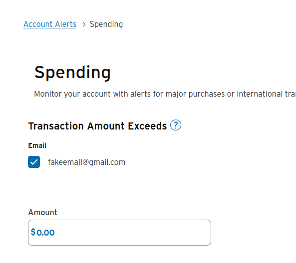

# google-budget-sync

This is a CLI tool designed to work with [Measure of a Plan's Budget Tracking Google Sheet](https://themeasureofaplan.com/budget-tracking-tool/)

It will pull credit card transactions emails sent by your bank and insert rows into the spreadsheet

Currently supported banks: 

- Chase
- Citi 

You will also need to install `poetry` or `uv`

## Setup Banking Email Notifications 

### For Chase:


### For Citi: 
On the top left, click `Profile` > `Account Alerts`

Under `Spending`, set `Transaction Amount Exceeds > Email` to `0.00`



## Run 

Run 

```
poetry install
poetry run python cli.py --setup

```

## Configuring Constants

Copy `config_sample.py`

### Google Credentials 


## Running the script 

To run: 

```
poetry install
poetry run 
```

This will automatically pull from credentials.json and open up a browser for auth if credentials.json is not there. 

If credentials are expired: 

```
rm secrets/credentials.json
```

## TODO list 

- [ ] Write setup instructions for categories and credentials 
- [x] Create function to setup categories and credentials
- [ ] Improve output and logging
- [x] deploy on minikube with cron job
- [ ] auto-expire credentials.json
- [x] refactor `get_citi_transactions` and `get_transactions`
    - [ ] refactor to return transaction list 
    - [ ] order transactions list by date
- [x] add tests with google api mocks
- [ ] investigate Plaid (like Yodelee) for hobby purposes to talk directly to banks
- Build MCP server (scary) https://www.youtube.com/watch?v=5PBaiMEPBsE
  - integrate w/ Google Home/Gemini
  